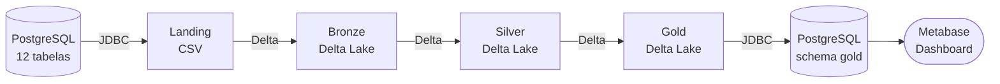
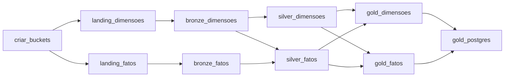

# Arquitetura do Pipeline

## Fluxo de Dados

## Camadas da Arquitetura Medalhão

### Landing
Dados brutos extraídos via JDBC (PySpark). Formato CSV, sem transformações.

### Bronze
Cópia fiel da Landing em Delta Lake. Sem regras de negócio — apenas tipagem conforme DDL.
Particionado por `ingestao_date` (ADR-0001).

### Silver
Limpeza, deduplicação e regras de negócio aplicadas:

- Plays inválidos removidos (`ms_tocados < 30.000 ms`)
- `completou` recalculado: `ms_tocados >= 90% duracao_ms`
- Status padronizado (`lower + trim`)
- Particionado por `ano_mes` do evento

### Gold
Star schema dimensional (ADR-0002). 2 fatos e 5 dimensões.
Espelhado no Postgres schema `gold` para o Metabase (ADR-0003).

**Fatos:** `fato_reproducao`, `fato_pagamento`

**Dimensões:** `dim_tempo`, `dim_usuario`, `dim_plano`, `dim_artista`, `dim_musica`

## DAG Airflow

A carga é **incremental por watermark** de `created_at` (ADR-0001).

## Infraestrutura Docker

| Container | Imagem | Porta |
|---|---|---|
| `streaming_postgres` | postgres:16-alpine | 5432 |
| `streaming_minio` | minio/minio:latest | 9000, 9001 |
| `streaming_airflow_webserver` | custom (Airflow + PySpark + Java) | 8080 |
| `streaming_airflow_scheduler` | custom | — |
| `streaming_metabase` | metabase/metabase:v0.50.15 | 3000 |
| `streaming_seed` | custom | — |